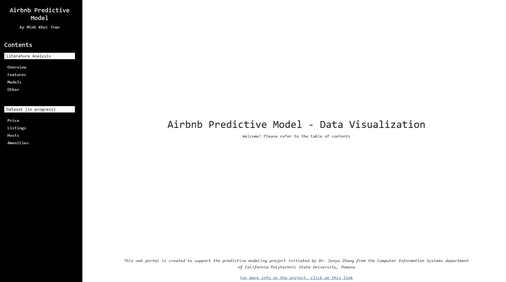

# RIO Airbnb Predictive Model

<h3 align='center'> Table of Contents: </h3>

* [Summary](#summary)
* [Getting Started](#getting-started)
* [Dependencies](#dependicies)
* [Web Portal](#web-portal)
* [Jupyter Notebooks](#notebooks)

<h2 align="center" id="summary"> Summary </h2>

This repository contains Jupyter Python and Python code belonging to Cal Poly Pomona's _Research through Inclusive Opportunities_ **(RIO)** research program.
For more information about the program and its associated projects: [Research through Inclusive Opportunities](https://www.cpp.edu/our-cpp/students/rio/index.shtml)

The repository is specifically created to support the Airbnb predictive modeling project from Dr. Sonya Zhang and the Computer Information Systems department. 
For more information on this particular project: [2022-23 Research Projects](https://www.cpp.edu/our-cpp/students/rio/projects.shtml) 


<h2 align="center" id="getting-started"> Getting Started </h2>

The Jupyter Notebook `.ipynb` files can be opened using either [Google Colaboratory](https://colab.research.google.com) or locally using [Visual Studio Code](https://code.visualstudio.com) and 3-rd party extensions.

If you decide to use Visual Studio Code to open the `.ipynb` files locally, be sure to download these required software:
* [Python](https://www.python.org/downloads/) (3.10 or above)
* [Jupyter Extension](https://marketplace.visualstudio.com/items?itemName=ms-toolsai.jupyter) (can be installed within Visual Studio Code through the `Extensions` tab)

Since the `listings.csv` was too large to be directly published to GitHub, it has been included inside `dataset.zip`. Remember to unzip the folder and make sure the folder's name is `dataset`.

**CAUTION:** The `airbnblib` folder is meant to house custom-made functions used in the notebooks. Remember to include the `airbnblib` folder in the same directory as your notebooks, or else many functionalities would not work.

<h2 align='center' id="dependencies"> Dependencies </h2>

All required dependencies are now listed in the `requirements.txt` file

To install these Python libraries, use `pip install -r requirements.txt` in the root directory of the project, i.e.:
```
C:\...\rio-airbnb-predictive-model> pip install -r requirements.txt
```

<h2 align='center' id="web-portal"> Web Portal </h2>


<div align="center">
  
</div>

This a web portal created to serve this project, either to showcase exploratory data analysis, model results, or as interactive demos of the model itself. Below are documentation about each part of the web portal:

1. Literature Analysis
   * Web portal designed to showcase results of our analysis of related literature, including various papers about Airbnb price predicting models and sentiment analysis techniques.
   * Include four sections: Overview, Features, Models, and Other

### Run the Web Portal
* To access the web portal locally using this repository, run these commands in the root directory:
```bash
cd literature-web-portal
python app.py
```
* After the commands run, this prompt should appear:
```
Dash is running on http://127.0.0.1:8050/

 * Serving Flask app 'app'
 * Debug mode: on
```
* Navigate to the given URL address on your browser to access the web portal

<h2 align='center' id="notebooks"> Jupyter Notebooks </h2>

### `rough_clean`
* Notebook for making broad strokes to clean and refine the data. 
* For more involved data refining processes such as sentimental analysis, future notebooks will be created specifically for those purposes 

### `exploratory_analysis`
* Notebook for doing exploratory data analysis into the data, which will be used to determine which variables to delete, edit, etc.
